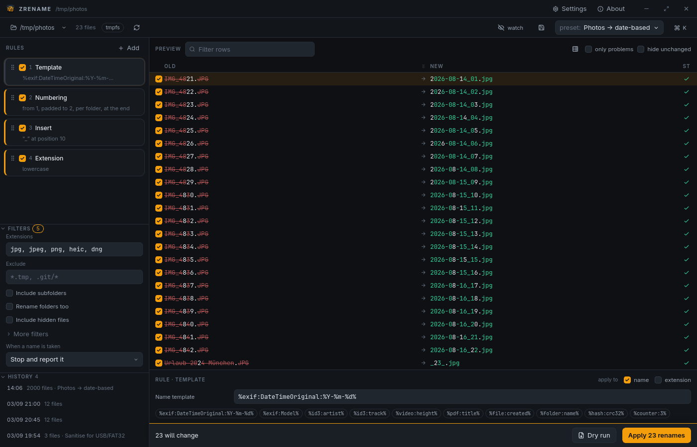
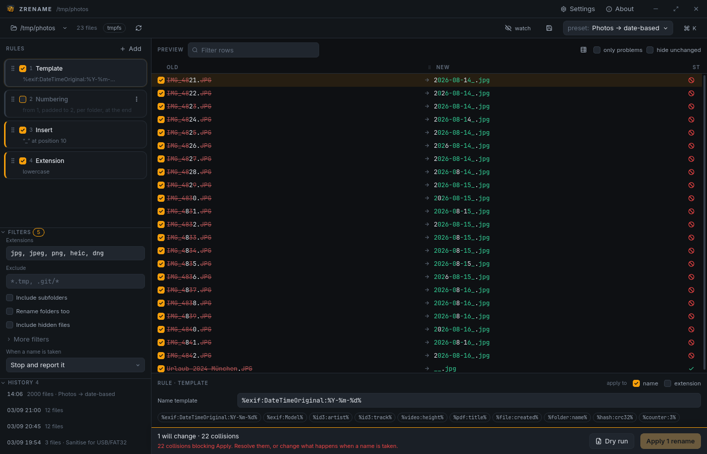
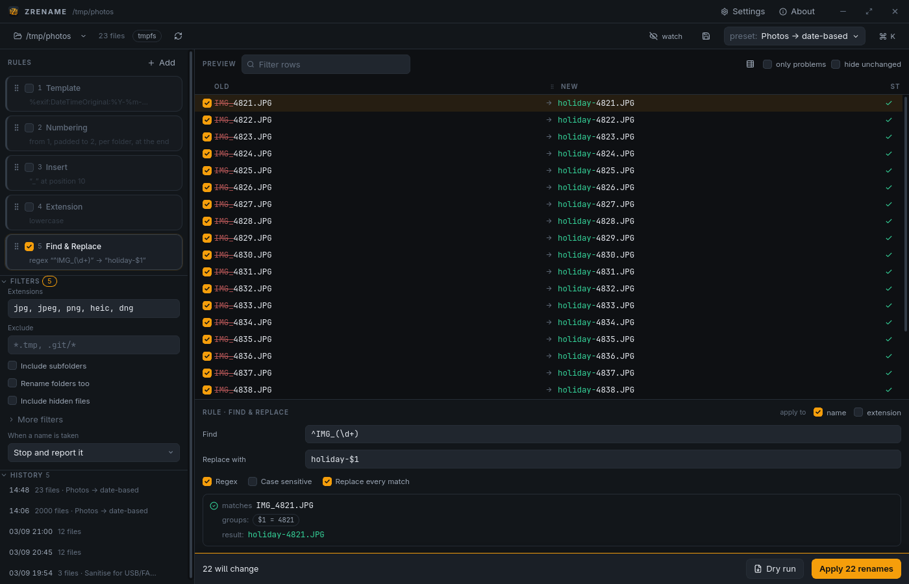
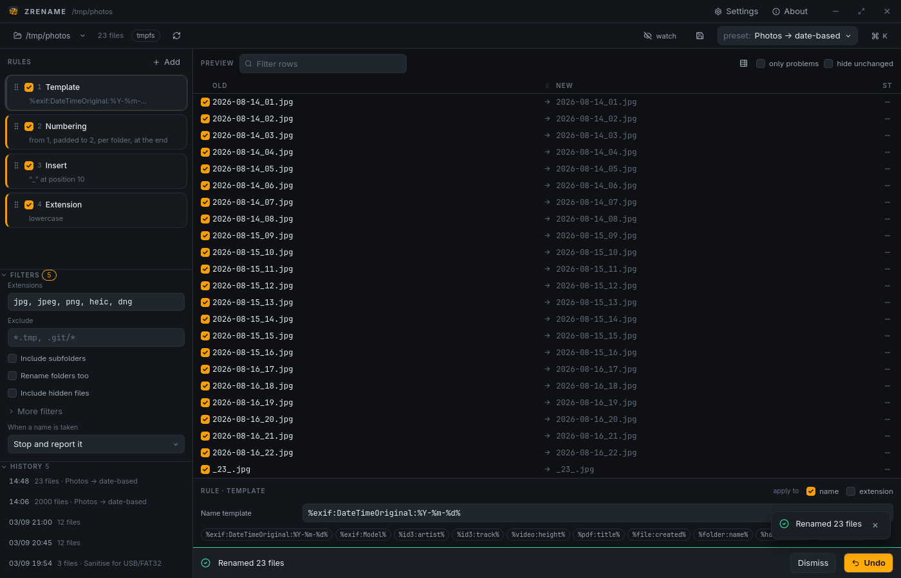
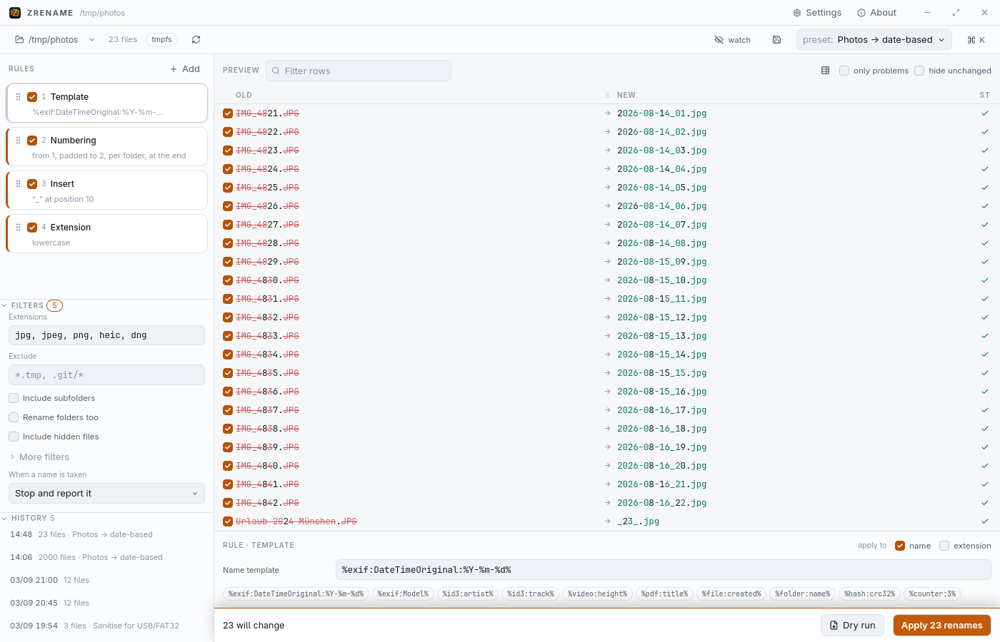
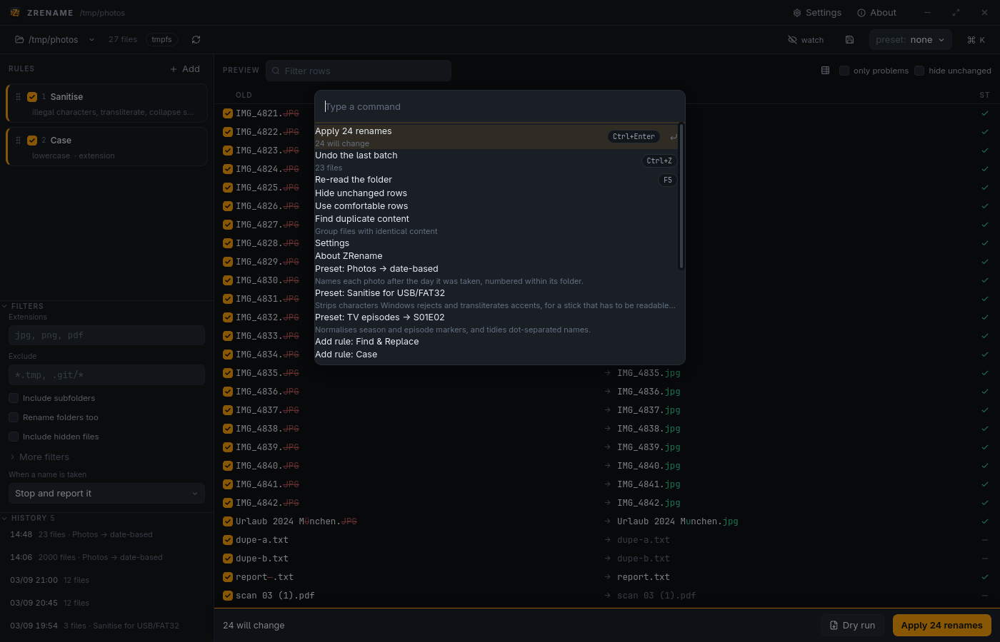
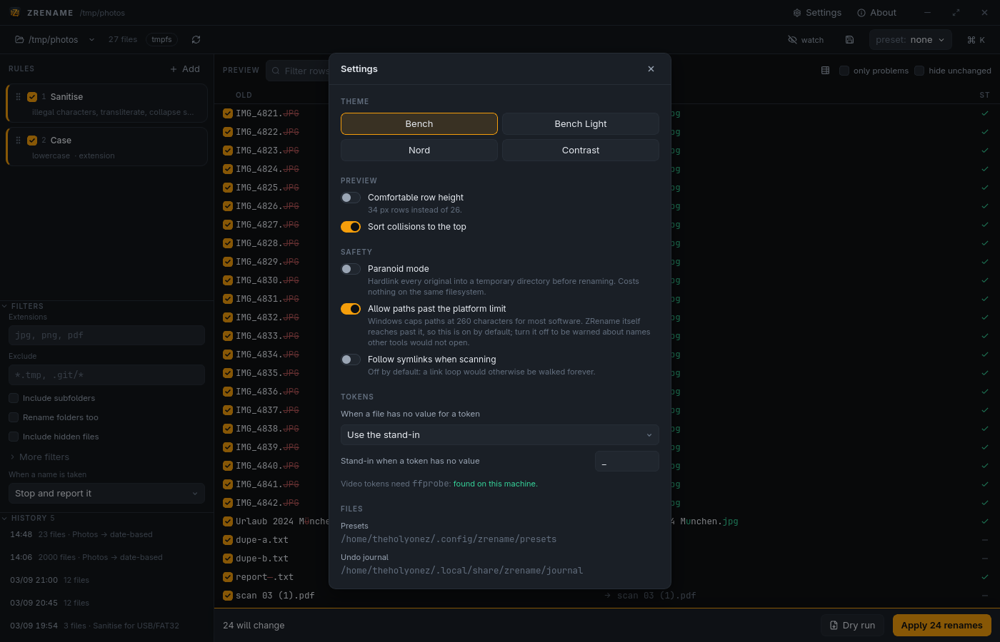
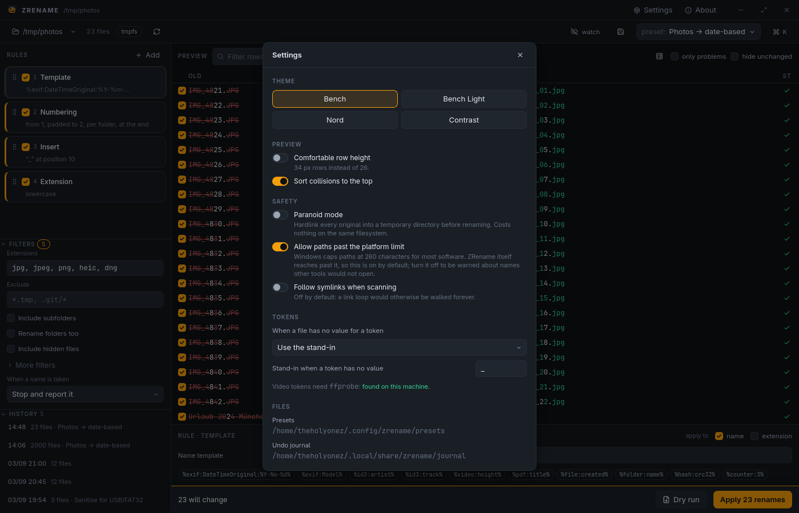
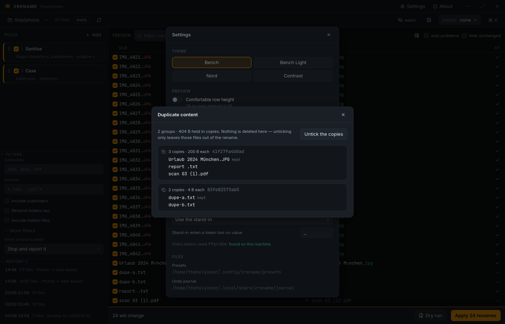

<div align="center">


# ZRename

### Rename ten thousand files without fear

**A bulk file renamer for Linux and Windows.** Drop a folder in, stack up rules,
watch a live before/after table with collisions flagged in red, and press Apply.
If it was wrong, press Undo — and every file goes back, *including after a
reboot*.

[](LICENSE)
[](#install)
[](https://v2.tauri.app)
[](#tests)

**[zsync.eu/zrename](https://zsync.eu/zrename/)** — homepage and downloads

<br />



<sub><b>Free · open source · no telemetry · no account · works offline</b></sub>

</div>

<br />

<table>
<tr>
<td width="25%" align="center"><b>Preview before you commit</b><br /><sub>A live table with a character-level diff, so you see the exact result of every rule before a single file moves.</sub></td>
<td width="25%" align="center"><b>Undo that actually works</b><br /><sub>Every batch is journalled to disk before the first rename. Undo a batch you ran yesterday.</sub></td>
<td width="25%" align="center"><b>Rules that stack</b><br /><sub>Eleven rule types, reorderable and individually toggleable, like an image editor's adjustment layers.</sub></td>
<td width="25%" align="center"><b>Names from metadata</b><br /><sub>EXIF, ID3, video, PDF and hashes turn a string tool into a librarian.</sub></td>
</tr>
</table>

---

## Contents

- [Why another bulk rename tool](#why-another-bulk-rename-tool)
- [How it keeps your files safe](#how-it-keeps-your-files-safe)
- [Screenshots](#screenshots)
- [Every feature](#every-feature)
- [Install](#install)
- [Quick start](#quick-start)
- [The rules](#the-rules)
- [Metadata tokens](#metadata-tokens)
- [Presets](#presets)
- [Filters](#filters)
- [Command line](#command-line)
- [Keyboard](#keyboard)
- [Performance](#performance)
- [Where things live](#where-things-live)
- [Building from source](#building-from-source)
- [Licence](#licence)

---

## Why another bulk rename tool

Renaming a pile of files is a chore that hits everyone — phone photo dumps,
downloaded series, exported invoices, asset folders, scanned documents — and the
existing tools are genuinely bad at it.

| Tool | What it gets wrong |
|---|---|
| **Advanced Renamer** | Windows only · cluttered interface · closed source |
| **Bulk Rename Utility** | Windows only · legendarily overwhelming, fourteen panels at once |
| **PowerToys PowerRename** | Windows only · one regex rule · no metadata · no undo journal |
| **krename** | KDE-bound · dated · weak preview · no journalled undo |
| **Thunar bulk rename** | Three rule types · no stacking · no presets |
| **`rename` / shell loops** | No preview · no undo · one typo from wrecking a folder |
| **ZRename** | **Linux and Windows · eleven stacking rules · metadata tokens · undo that survives a reboot** |

Two things stand out on that list.

Almost none of them have a **real undo** — and when a rule was wrong on 4,000
files, undo is the only feature that matters.

And **none** of them handle the case-insensitive filesystem trap. Renaming
`photo.JPG` → `photo.jpg` on Windows silently fails or clobbers the file unless
the rename goes through a temporary name first. ZRename detects that case and
does the two-phase dance for you, without asking and without mentioning it.

---

## How it keeps your files safe

Correctness is the entire product, so the engine is built in that order.

```
files × rules ──▶  plan  ──▶  validate  ──▶  journal  ──▶  execute
                 (a pure     (collisions,   (written     (two-phase
                  function)   bad names,     and flushed   where a cycle
                              limits)        first)        needs it)
```

<table>
<tr><td width="50%">

**1 · Plan first, touch nothing**

`files × rules → plan` is a pure function. Nothing on disk is touched while you
type in a rule, so the preview can never half-apply something.

**2 · Validate against the real filesystem**

Collisions — case-folded when the filesystem ignores case — characters the
target rejects, Windows device names like `CON.txt`, name length in the right
unit (255 **bytes** on ext4 versus 255 **UTF-16 units** on NTFS), and the
260-character `MAX_PATH` limit.

</td><td width="50%">

**3 · Journal, then execute**

The undo journal is written and flushed to disk *before the first rename*, so a
crash mid-batch still leaves a complete record. Swap cycles (`a→b`, `b→a`) and
case-only changes go through a temporary name; everything else renames directly.

**4 · Undo verifies before it moves**

Each file's size and modification time are checked against the journal first. A
file you edited since the rename is **reported, never overwritten**.

</td></tr>
</table>

> [!IMPORTANT]
> **Overwrite is never a default.** The conflict policy starts at *stop and
> report it*, and even when you choose overwriting it refuses to settle two
> selected files that want the same name — one of them would simply be lost.

> [!TIP]
> Windows filesystem rules are stored as **data, not `#[cfg]` blocks**. An
> `FsProfile` value describes case folding, illegal characters, reserved device
> names and length limits, so the NTFS and FAT32 rule sets are exercised by unit
> tests on *any* machine — and re-run against real NTFS on a Windows CI runner.

---

## Screenshots

<table>
<tr>
<td width="50%" valign="top">

### Collisions block Apply



Rows that would land on a name another row wants are flagged, sorted to the top,
and Apply stays disabled with a plain-English reason. Collision red is used for
collisions and for **nothing else** in the app.

</td>
<td width="50%" valign="top">

### A regex tester that removes the guesswork



The editor tests your pattern against the row you have selected and shows the
capture groups and the final result as you type. Rules toggle off without being
deleted.

</td>
</tr>
<tr>
<td width="50%" valign="top">

### Undo, even after a restart



After applying, the commit bar becomes a confirmation strip with Undo. Every
batch also lands in the history list — and those survive quitting the app.

</td>
<td width="50%" valign="top">

### Light is a first-class theme



Long file lists genuinely read better on a light ground, so *Bench Light* is not
an afterthought. *Bench*, *Nord* and a high-*Contrast* theme ship alongside it.

</td>
</tr>
<tr>
<td width="50%" valign="top">

### Everything from the keyboard



<kbd>Ctrl</kbd> <kbd>K</kbd> reaches every command, preset, rule and theme
without leaving the keyboard.

</td>
<td width="50%" valign="top">

### Settings that explain themselves



Four themes, row density, paranoid mode, path-limit handling, and what to do
when a file has no value for a token.

</td>
</tr>
<tr>
<td width="50%" valign="top">

### Filters that reach the whole folder



Extensions, globs both ways, a name regex, a size range and a date range —
before any rule runs.

</td>
<td width="50%" valign="top">

### Duplicate-aware



Grouped by size first, then hashed, so only real candidates are read. It can
untick the copies and leave the first of each group to be renamed.

</td>
</tr>
</table>

---

## Every feature

<table>
<tr><td valign="top" width="33%">

### Rules

- **Find & replace** — plain text or regex with `$1` capture groups, case-sensitive or not, first match or all
- **Case** — lower, UPPER, Title, Sentence, camelCase, PascalCase, snake_case, kebab-case
- **Insert** — at a position, at the start or end, before or after a marker
- **Remove** — a character range, a set of characters, a word, every digit, or repeated text
- **Trim** — surrounding whitespace, a custom character set, collapse runs of spaces
- **Numbering** — start, step, padding, per-folder reset, ascending or descending, sorted by name, natural order, size or date
- **Extension** — set, fill when missing, lowercase, uppercase, remove
- **Sanitise** — strip illegal characters, collapse spaces, transliterate Unicode → ASCII, trim trailing dots
- **Template** — rebuild the name from metadata tokens
- **Move into folders** — file results into subfolders derived from tokens
- **CSV mapping** — rename from an external `old,new` list

Every rule can be **scoped** to the name, the extension, or both. Reorder by
dragging, by <kbd>Alt</kbd> <kbd>↑</kbd>/<kbd>↓</kbd>, or from the card menu.

</td><td valign="top" width="33%">

### Preview

- Virtualised table — 100,000 rows scroll without stutter
- Character-level diff: green for added, struck-through red for removed
- Per-row status: ok, unchanged, **collision**, invalid, too long, reserved name, skipped
- Leading and trailing whitespace shown as a visible `·`
- Every filename in a monospace face, so a double space or an `l`/`1` is obvious
- Symlinks marked — ZRename renames the link, never its target
- Folders marked, moves marked, case-only changes marked
- **Untick any row** to leave that one file alone
- Filter by text, or show only problems
- Hide unchanged rows
- Collisions sorted to the top
- Draggable, persisted column widths
- Comfortable or compact row height
- Drag the table out as CSV, or write it with **Dry run**

</td><td valign="top" width="33%">

### Safety and workflow

- **Journalled undo** that survives a restart, with a history list per batch
- Undo verifies size and modification time before moving anything
- **Two-phase renames** for swap cycles and case-only changes
- Conflict policy: stop · skip · suffix `(2)` · overwrite
- **Warns before Apply** when the target filesystem has rules your names may not survive
- **Paranoid mode** hardlinks every original into a temp directory first
- Presets as plain, shareable TOML, with import and export
- **Watch a folder** and apply the stack to whatever arrives
- Duplicate detection that can untick the copies
- Files with a missing token can be **left alone** instead of named after a stand-in
- The rule stack, folder, filters and preset **survive quitting**
- Recent folders
- Cross-filesystem moves fall back to copy-and-delete
- A command line over the same engine

</td></tr>
</table>

---

## Install

### [⬇ Download from zsync.eu/zrename](https://zsync.eu/zrename/)

The homepage detects your system and hands you the right file. Every build is
also on [GitHub Releases](../../releases).

| Platform | File |
|---|---|
| **Windows 10/11** | `ZRename_x.y.z_x64-setup.exe` — NSIS installer |
| **Debian / Ubuntu** | `ZRename_x.y.z_amd64.deb` |
| **Fedora / RHEL** | `ZRename-x.y.z-1.x86_64.rpm` |
| **Any Linux** | `ZRename_x.y.z_amd64.AppImage` |

The Linux packages install a desktop entry, so ZRename appears in your
application menu and in a file manager's **Open with** for folders.

---

## Quick start

Drop a folder onto the window, pick it with the folder button, or name it on the
command line:

```sh
zrename-desktop ~/Pictures/import
zrename-desktop ~/Pictures/import --preset "Photos → date-based"
```

Then stack up rules, read the preview, and press **Apply**. The button always
states the number — *Apply 1,281 renames* — and it is disabled while any
collision is unresolved.

Three presets ship with the app:

| Preset | What it does |
|---|---|
| **Photos → date-based** | `IMG_4821.JPG` → `2026-08-14_01.jpg`, numbered within each folder, from the EXIF capture date |
| **TV episodes → S01E02** | Normalises season and episode markers, pads them to two digits, tidies dot-separated names |
| **Sanitise for USB/FAT32** | Strips characters Windows rejects, transliterates accents, lowercases extensions |

---

## The rules

<details>
<summary><b>Find &amp; replace</b> — plain or regex</summary>

Plain text by default, case-insensitive. Tick **Regex** for full expressions
with `$1` back-references, and the editor grows a live tester showing the match,
the capture groups and the result against the row you have selected.

The replacement may contain metadata tokens. A `$` that came out of a token is
escaped automatically, so a filename containing `$1` cannot accidentally become
a capture reference.

</details>

<details>
<summary><b>Numbering</b> — sequential, sorted, per folder</summary>

Start, step and zero-padding, ascending or descending, restarting in each folder
or running straight through. The order is chosen explicitly: by name, by
**natural** order (so `img2` comes before `img10`), by size, or by modification
or creation date.

Numbering is resolved in a sequential pass before the parallel one, so the
result is identical every time however many cores run it.

</details>

<details>
<summary><b>Sanitise</b> — make a name safe to carry anywhere</summary>

Removes characters the *target* filesystem rejects, so a FAT32 stick is cleaned
more strictly than an ext4 disk. Optionally transliterates Unicode to ASCII
(`München` → `Munchen`), collapses runs of spaces, and trims the trailing dots
and spaces Windows silently drops.

</details>

<details>
<summary><b>Move into folders</b> — turn renaming into organising</summary>

A template such as `%exif:DateTimeOriginal:%Y%/%exif:DateTimeOriginal:%m%` files
each result into `2026/08/`. Folders are created as needed, and a leading `/` or
`..` is stripped so results always stay under the folder you loaded.

</details>

<details>
<summary><b>CSV mapping</b> — names produced somewhere else</summary>

Point it at a file of `old,new` lines and only the listed files are renamed.
Anything missing from the list is left alone.

</details>

---

## Metadata tokens

Resolved per file, lazily, and cached for the session. A file that has no value
for a token gets a configurable stand-in — or, if you prefer, is **left alone
entirely**.

| Namespace | Examples |
|---|---|
| `exif` | `%exif:DateTimeOriginal:%Y-%m-%d%` · `%exif:Model%` · `%exif:Make%` · `%exif:Y-m-d%` |
| `id3` | `%id3:artist%` · `%id3:album%` · `%id3:title%` · `%id3:track%` · `%id3:year%` |
| `video` | `%video:width%` · `%video:height%` · `%video:fps%` · `%video:duration%` — needs `ffprobe` |
| `pdf` | `%pdf:title%` · `%pdf:author%` · `%pdf:pages%` · `%pdf:creator%` |
| `file` | `%file:stem%` · `%file:ext%` · `%file:size%` · `%file:created:%Y%` · `%file:modified%` |
| `folder` | `%folder:name%` · `%folder:parent%` |
| `hash` | `%hash:crc32%` · `%hash:blake3%` |
| `counter` | `%counter:3%` · `%index:2%` |

The format segment is `%ns:key:fmt%`. Because strftime itself uses `%`, there is
an unambiguous form when a template gets hairy:

```
%exif:DateTimeOriginal{%Y-%m-%d}%
```

---

## Presets

Plain TOML in a directory, so a preset can be shared, diffed, version-controlled
and edited by hand.

```toml
name = "Photos → date-based"
description = "Names each photo after the day it was taken."

[[rules]]
kind = "template"
template = "%exif:DateTimeOriginal:%Y-%m-%d%"

[[rules]]
kind = "number"
start = 1
pad = 2
reset_per_folder = true
sort = "natural"

[[rules]]
kind = "extension"
mode = "lower"
```

<kbd>Ctrl</kbd> <kbd>S</kbd> saves the current stack as one.

---

## Filters

Applied before any rule runs, so the preview only ever shows files you meant.

| Filter | Example |
|---|---|
| Extensions | `jpg, png, pdf` |
| Only these (glob) | `IMG_*, DSC_*` |
| Exclude (glob) | `*.tmp, .git/*` |
| Name matches (regex) | `^S\d{2}E\d{2}` |
| Size range | `1MB` to `500MB` — also `1.5 GiB`, `500k` |
| Modified range | a date on either side |
| Subfolders | on, with an optional depth limit |
| Folders and hidden files | off by default |

---

## Command line

The same engine backs a CLI, so a preset built by clicking behaves identically
in a script or a cron job.

```sh
zrename init-presets                                             # write the starter presets
zrename presets                                                  # list what is available
zrename run ~/Pictures/import --preset "Photos → date-based"     # dry run: prints the plan
zrename run ~/Pictures/import --preset "Photos → date-based" --apply
zrename history                                                  # past batches
zrename undo                                                     # put the last one back
zrename undo 2026-09-04T14-06-08.770                             # or a specific one
```

| Flag | |
|---|---|
| `--recursive`, `--max-depth N` | walk subfolders |
| `--ext jpg,png` | restrict by extension |
| `--csv plan.csv` | write the plan instead of printing it |
| `--on-conflict skip\|suffix\|overwrite` | what to do about a taken name |
| `--paranoid` | hardlink originals before touching anything |
| `--apply` | commit; without it nothing is written |

> [!NOTE]
> The desktop binary is **`zrename-desktop`** and the command-line one is
> **`zrename`**, so installing both leaves you with two commands that do not
> fight over a name.

---

## Keyboard

| | | | |
|---|---|---|---|
| <kbd>Ctrl</kbd> <kbd>K</kbd> | Command palette | <kbd>Alt</kbd> <kbd>↑</kbd>/<kbd>↓</kbd> | Reorder the selected rule |
| <kbd>Ctrl</kbd> <kbd>Enter</kbd> | Apply | <kbd>Ctrl</kbd> <kbd>D</kbd> | Duplicate the selected rule |
| <kbd>Ctrl</kbd> <kbd>Z</kbd> | Undo the last batch | <kbd>Ctrl</kbd> <kbd>N</kbd> | Add a rule |
| <kbd>Ctrl</kbd> <kbd>F</kbd> | Filter the preview | <kbd>Ctrl</kbd> <kbd>S</kbd> | Save the stack as a preset |
| <kbd>F5</kbd> | Re-read the folder | <kbd>Delete</kbd> | Remove the selected rule |
| <kbd>Space</kbd> | Toggle the selected rule | | |

---

## Performance

Measured, not estimated.

| Workload | Time |
|---|---|
| 2,000 JPEGs → dated, numbered names (scan, plan, validate) | **18 ms** |
| …applied to disk, with the journal flushed first | **103 ms** |
| …all 2,000 reverted by a separate process | **25 ms** |
| 100,000 files scanned, planned and validated | **665 ms** |
| 100,000 files where every row also attempts an EXIF lookup | **902 ms** |

Rules run under [`rayon`](https://github.com/rayon-rs/rayon), the preview table
is virtualised, and the plan stays in Rust — the interface asks only for the
window of rows it is currently showing, so a 100,000-file preview never
serialises 100,000 rows.

---

## Where things live

| | Linux | Windows |
|---|---|---|
| Presets | `~/.config/zrename/presets/*.toml` | `%APPDATA%\zrename\presets` |
| Undo journal | `~/.local/share/zrename/journal/*.json` | `%LOCALAPPDATA%\zrename\journal` |

A journal entry records `{from, to, size, mtime, inode}` per file, which is what
lets undo tell *"this is the file I renamed"* from *"something else is here
now"*.

---

## Building from source

Needs [pnpm](https://pnpm.io), a Rust toolchain, and the
[Tauri v2 prerequisites](https://v2.tauri.app/start/prerequisites/).

```sh
git clone https://github.com/TheHolyOneZ/ZRename
cd ZRename
pnpm install

pnpm tauri dev      # run it
pnpm tauri build    # bundle it
```

### Layout

```
crates/zrename-core/   the engine: scan, plan, validate, journal, execute.
                       No Tauri, no UI, and where most of the tests live.
crates/zrename-cli/    the command line, over the same engine
src-tauri/             the desktop shell and its IPC commands
src/                   React 19 frontend
```

### Tests

```sh
cargo test --workspace   # 254: rules, token parsing, filesystem profiles, cycle
                         # detection, journal round-trips, real renames on disk
pnpm test                # 30: diff rendering, size parsing, rule summaries
```

The Windows job in CI runs the same suite on a `windows-latest` runner, so NTFS
behaviour is checked against real NTFS rather than only simulated.

---

## Licence

[**GPL-3.0**](LICENSE) · built by [TheHolyOneZ](https://github.com/TheHolyOneZ)

<div align="center">
<br />

**[zsync.eu/zrename](https://zsync.eu/zrename/)** — homepage &amp; downloads
<br />
**[GitHub](https://github.com/TheHolyOneZ/ZRename)** — source · **[TheHolyOneZ](https://github.com/TheHolyOneZ)** — the author · **[zsync.eu](https://zsync.eu)** — more projects · **[zlogic.eu](https://zlogic.eu)** — game mods

<br />
<sub>
<b>Keywords</b> · bulk rename · batch rename files · mass file renamer · rename
multiple files at once · regex file rename · rename photos by EXIF date · rename
by metadata · ID3 rename music files · Linux file renamer · Windows bulk rename
tool · Advanced Renamer alternative · Bulk Rename Utility alternative · krename
alternative · PowerRename alternative · free open source renamer · undo file
rename · batch rename with preview · Rust · Tauri
</sub>

</div>
